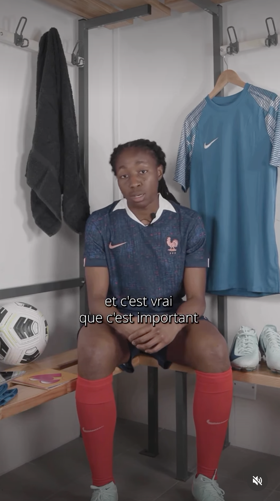

**Les règles peuvent-elles empêcher de jouer au football ?**

On les connaît les publicités qui nous disent qu’on peut tout faire sans aucune incidence quand on a ses règles… La réalité est un peu différente.

En 2024, Règles Élémentaires et le [Fondaction du Football](https://www.fondactiondufootball.com/education-menstruelle) ont lancé l’enquête « J’ai mes règles, je fais du foot », menée auprès de 980 clubs de football amateur et de 622 joueuses âgées de 11 à 18 ans.

Les résultats montrent à quel point les règles peuvent encore peser sur la pratique sportive :

* une joueuse sur trois est stressée lorsqu’elle va à l’entraînement pendant ses règles ;
* 38 % ont déjà dû manquer un match à cause de leurs règles ;
* 41 % ne se sentent pas à l’aise pour en parler au sein de leur club ;
* sept joueuses sur dix ont déjà eu le sentiment d’être moins performantes pendant un entraînement ou un match à cause de leurs règles ;
* près de 80 % pensent qu’il n’existe pas assez d’informations sur les liens entre les règles et le sport.

Derrière ces chiffres, il y a des douleurs, de l’inconfort, la peur d’une fuite, le manque d’accès aux protections, mais aussi la difficulté à parler du sujet avec les autres joueuses ou avec l’encadrement.

Bref, le problème ne se trouve pas seulement sur le terrain. Il se trouve aussi dans tout ce qui manque encore autour : de l’information, des équipements adaptés, des personnes formées et des espaces où il est possible de parler de ses règles sans gêne.

**Du constat à l’action**

Depuis 2024, nous travaillons avec le Fondaction du Football pour mieux intégrer les enjeux de santé menstruelle dans le football amateur.

Des ateliers de sensibilisation ont été organisés dans les clubs auprès des joueuses, des joueurs, des éducateurs et des éducatrices. Depuis 2025, des webinaires permettent également de rendre ces contenus accessibles à un plus grand nombre de personnes.

À partir de la saison 2026-2027, ce travail prend une nouvelle ampleur grâce à notre partenariat avec la Fédération Française de Football.

Plusieurs actions seront progressivement déployées :

* des ateliers pour les joueuses et joueurs de 11 à 18 ans, afin de mieux comprendre le cycle menstruel, de déconstruire les idées reçues et de parler de ses effets possibles sur la pratique sportive ;
* des formations à destination des éducateur·ices, formateur·ices, dirigeant·es et autres membres de l’encadrement ;
* des fiches pratiques intégrées au Programme éducatif fédéral, pour proposer aux clubs des ressources simples et directement utilisables ;
* des interventions auprès des joueuses de Next Gen Coaches, âgées de 14 à 18 ans, pour les sensibiliser en tant que joueuses, mais aussi en tant que futures encadrantes.

L’idée est de donner aux coachs les connaissances et les outils nécessaires pour écouter, répondre aux questions et mieux accompagner les jeunes sportives.

[Découvrir la présentation du partenariat sur le site de la Fédération Française de Football](https://www.fff.fr/article/17312-la-fff-avec-regles-elementaires-pour-lever-les-tabous.html)

**Et au plus haut niveau, on en parle ?**

Oui, et il était temps.

Dans le cadre de ce partenariat, nous avons rencontré quatre joueuses de l’Équipe de France féminine : Oriane Jean-François, Marie Petiteau, Justine Lerond et Clara Mateo.

Avec elles, nous avons parlé de la place des règles dans le sport de haut niveau, de leur expérience et de ce qui se passe réellement dans les vestiaires.

Leurs témoignages rappellent que les règles peuvent avoir des effets très concrets sur la pratique sportive, quel que soit le niveau. En parler ouvertement permet aussi aux plus jeunes de comprendre qu’il n’y a aucune honte à poser des questions, à demander un aménagement ou simplement à dire que l’on a ses règles.

[Regarder l’interview des joueuses sur Instagram](https://www.instagram.com/p/DdV1JRMsDpy/)

**Du football à tous les terrains**

Pendant plusieurs années, notre travail s’est concentré sur le projet « J’ai mes règles, je fais du foot ». En 2025, nous avons choisi d’élargir cette démarche à l’ensemble des disciplines sportives. Le projet est ainsi devenu « J’ai mes règles, je fais du sport ».

Les règles influencent encore fortement la pratique sportive, notamment chez les jeunes : inconfort, douleurs, manque d’information, peur des fuites, gêne ou absence d’adaptation des environnements. Autant de freins qui peuvent conduire à manquer un entraînement, éviter une compétition ou abandonner progressivement une activité.

Pour mieux intégrer les enjeux menstruels dans le sport, nous développons plusieurs types d’actions :

* la sensibilisation des jeunes athlètes ;
* la formation des encadrant·es ;
* la production de contenus et d’outils adaptés ;
* le travail avec les clubs, les établissements scolaires, les collectivités et les structures sportives.

Notre objectif : que les règles ne soient plus un frein à la pratique sportive.

Cela passe par une meilleure compréhension du cycle menstruel, mais aussi par des changements très concrets : trouver des protections sur place, avoir accès à des toilettes adaptées, pouvoir parler à une personne de confiance ou ajuster ponctuellement sa pratique lorsque cela est nécessaire.

**Pour aller plus loin**

Vous voulez mieux comprendre les liens entre règles et pratique sportive ou agir au sein de votre structure ?

* [Découvrir notre campagne « Règles et sport : carton rouge sur les tabous » et les résultats de notre enquête](https://cartonrouge.regleselementaires.com/)
* [Télécharger la brochure « J’ai mes règles, je fais du sport », spécialement conçue pour les jeunes](https://doccollectes.blob.core.windows.net/statics/brochure_sport_jeunes_A5-web.pdf)
* [Découvrir notre travail avec le Fondaction du Football](https://www.fondactiondufootball.com/education-menstruelle)

Le sport peut être un formidable espace d’émancipation, de confiance et de collectif.

À condition que les règles n’y restent pas sur le banc ;)
