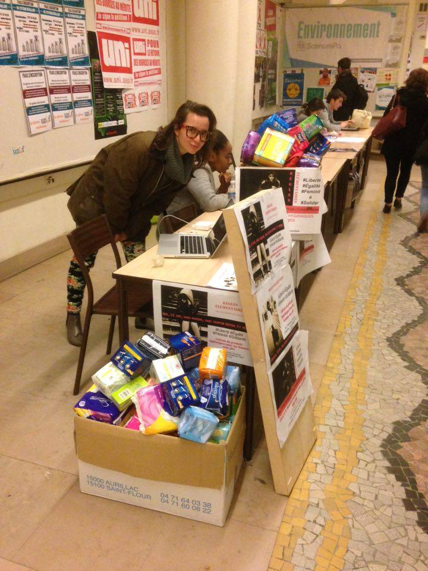

**Dix ans, ça se raconte comment ?**

Avec des chiffres, bien sûr (notre passion number one).

Depuis 2015, Règles Élémentaires a redistribué plus de 29 millions de protections périodiques, couvert plus de 3,3 millions de mois de règles et accompagné plus d’un million de bénéficiaires.

Des milliers de jeunes ont été sensibilisé·es. Des professionnel·les ont été formé·es. Des centaines de structures ont été accompagnées partout en France.

Mais dix ans d’impact ne tiennent pas seulement dans un tableau Excel.

Notre impact, c’est aussi une personne qui n’a plus à choisir entre acheter des protections et remplir son réfrigérateur. Une jeune fille qui comprend enfin ce qui se passe dans son corps. Un·e professionnel·le qui sait mieux accompagner les personnes qu’iel reçoit. Un sujet longtemps considéré comme intime ou honteux qui entre dans les établissements scolaires, les entreprises, les collectivités et le débat public.

C’est tout cela que nous avons voulu raconter.

**D’une première collecte à un mouvement national**

*Coucou Tara Heuzé-Sarmini, fondatrice de Règles Élémentaires qui organise la toute première collecte !*

Lorsque l’association est née en 2015, la précarité menstruelle était encore largement absente du débat public. Le terme lui-même était peu utilisé et les conséquences très concrètes du manque d’accès aux protections périodiques restaient invisibilisées.

Alors nous avons commencé par collecter.

Puis il a fallu redistribuer, structurer des réseaux, accompagner les associations et les professionnel·les de terrain. Très vite, une évidence s’est imposée : distribuer des protections est indispensable, mais cela ne suffit pas.

Il faut aussi informer, former, parler de santé menstruelle, déconstruire les tabous et faire évoluer les politiques publiques.

Au fil des années, Règles Élémentaires a grandi, développé de nouveaux programmes, ouvert des antennes territoriales, mobilisé des milliers de bénévoles et noué des partenariats avec des acteurs associatifs, publics et privés.

Une première collecte est devenue un mouvement national.

**Au-delà des chiffres, qu’est-ce qui a vraiment changé ?**

Pour réaliser ce récit d’impact, nous avons regardé notre histoire sous plusieurs angles.

Nous avons bien sûr étudié les données liées à nos actions. Mais nous avons aussi recueilli des témoignages, croisé les regards de nos partenaires, de nos bénévoles, des structures accompagnées et des personnes sensibilisées.

Nous voulions répondre à des questions simples, mais essentielles.

Comment les représentations des règles ont-elles évolué en dix ans ? Quelles avancées avons-nous contribué à obtenir ? Qu’est-ce qui a changé dans les pratiques professionnelles, dans les établissements scolaires, dans les associations ou dans les institutions ? Et surtout, qu’est-ce que cela change réellement dans la vie des personnes qui ont leurs règles ?

Ce travail montre que parler des règles transforme bien plus que notre manière de considérer les menstruations. Cela permet de parler de dignité, de santé, d’éducation, de droits et d’égalité.

**Dix ans plus tard, le tabou n’a pas disparu**

En dix ans, les règles ont gagné une place nouvelle dans l’espace public. On en parle davantage, les connaissances progressent et certaines avancées que nous réclamions depuis longtemps deviennent enfin une réalité.

Mais le travail est loin d’être terminé.

Des millions de personnes restent confrontées à la précarité menstruelle. Les douleurs sont encore trop souvent banalisées. L’éducation menstruelle reste très inégale. La composition des protections périodiques manque toujours de transparence. Et selon son âge, son territoire, son handicap ou sa situation économique, vivre ses règles dignement peut encore relever du parcours d’obstacles.

Ce récit d’impact permet donc de regarder le chemin parcouru, sans perdre de vue celui qu’il reste à faire.

**Changer les règles, et maintenant ?**

À l’occasion de nos dix ans, nous avons fait évoluer notre identité et affirmé plus clairement notre ambition : agir pour l’égalité et la justice menstruelle.

La justice menstruelle, c’est la possibilité pour toutes les personnes qui ont, avaient ou auront leurs règles de les vivre dignement, sans tabou et en sécurité.

Cela implique de garantir l’accès aux protections périodiques, mais aussi à une information fiable, à des soins adaptés et à des environnements qui prennent réellement en compte les menstruations.

Depuis dix ans, nous travaillons pour faire évoluer les mentalités, les pratiques et les lois. Ce récit raconte ce que nous avons déjà rendu possible, grâce aux bénévoles, donateur·ices, partenaires, équipes salariées et personnes engagées à nos côtés.

Il raconte aussi ce que nous voulons construire pour les dix prochaines années.

[Découvrir notre récit d’impact des 10 ans](https://www.calameo.com/read/008256091cb6d5b9323db)
